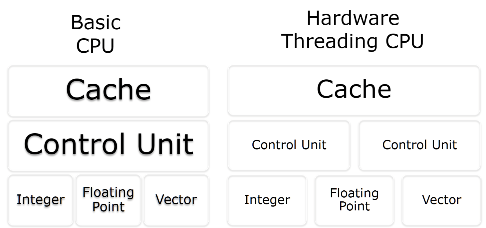
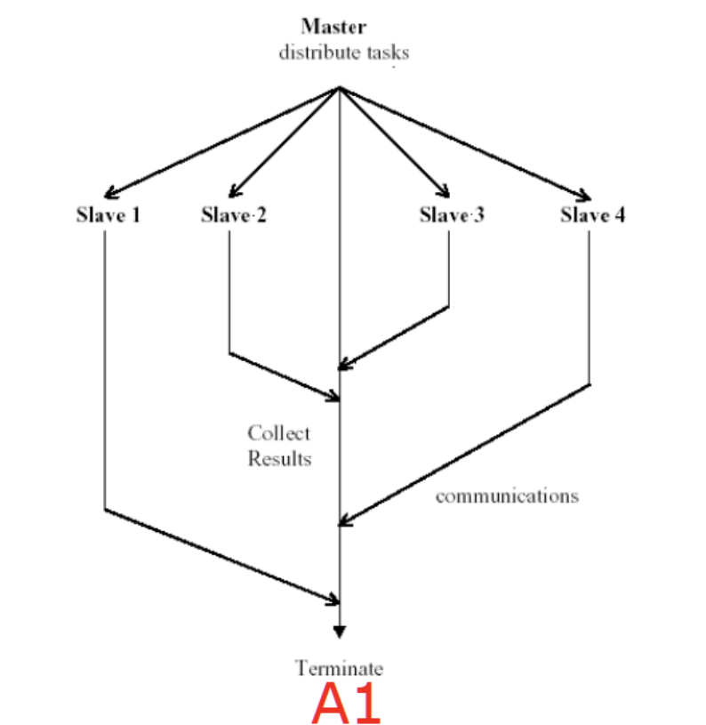
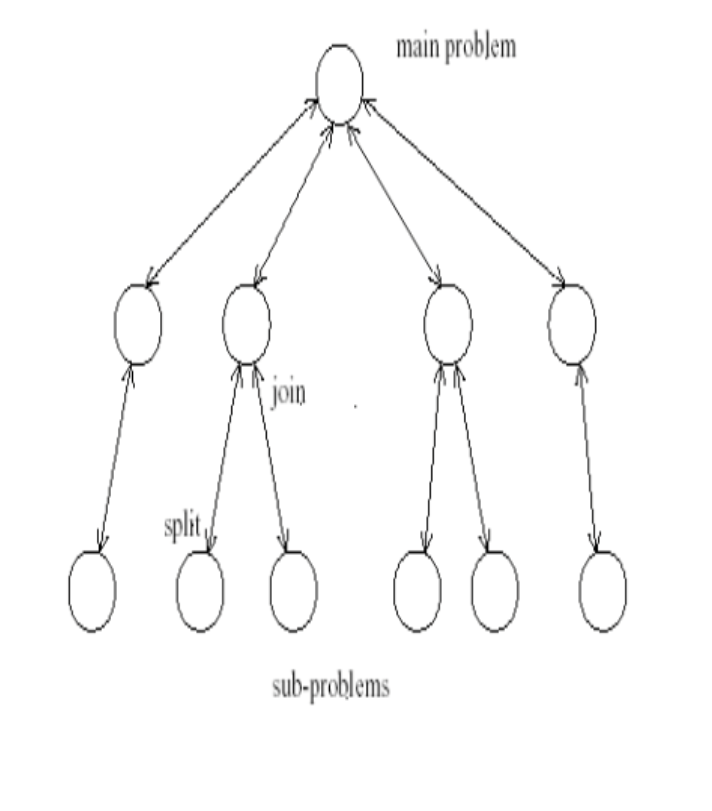

# Information Session & How we got here

[[toc]]
## Cloud Computing

### Definition

1. What: Different types of computing resources
2. How: Through network
3. Why: On-demand (Lower cost & better  utilization)
4. Cloud computing is a technology to utilize heterogeneous computing resource through network and provide on-demand service
### Characteristics

#### On-demand self-service

A consumer can provision computing capabilities as needed without requiring human interaction interaction with each service provider.
消费者可以根据需要预置计算功能，而无需与每个服务提供商进行人工交互。
#### Network access

Capabilities are available over the network and accessed through standard mechanisms that promote use by heterogeneous client platforms.
功能可通过网络获得，并通过促进异构客户端平台使用的标准机制进行访问。
#### Resource pooling

The provider's computing resources are pooled to serve multiple consumers using a multi-tenant model potentially with different physical and virtual resources that can be dynamically assigned and reassigned according to consumer demand.

提供商的计算资源被池化，以使用多租户模型为多个消费者提供服务，这些模型可能具有不同的物理和虚拟资源，这些资源可以根据消费者需求动态分配和重新分配。

#### Rapid elasticity

Capabilities can be elastically provisioned and released, in some cases automatically, to scale rapidly upon demand
功能可以弹性配置和发布，在某些情况下是自动的，以便根据需要快速扩展
#### Measured service

Cloud systems automatically control and optimize resource use by leveraging a metering capability at some level of abstraction appropriate to the type of service
云系统通过利用适合服务类型的某种抽象级别的计量功能来自动控制和优化资源使用

> [!question|closed] 什么是Heterogeneous? 通过网络使用多种Computing resource 有什么好处？
>- **Heterogeneous异质**:  计算资源的类型/架构/配置/平台/性能/...差异
>- 异构性可能会导致兼容性问题，影响服务运行
>- 网络的优势:  打破物理边界/统一管理快速调配

> [!question|closed] 什么是Pooling? Pooling有什么好处?
>- 由于处理任务类型不同 打破传统资源界限，抽象为更小的单位进行组合调配
>- Resource pooling的好处:   On-demand/利用率高/成本低/服务提供商统一维护/技术门槛低

> [!question|closed] Cloud computing 支持Elasticity是否是必要的？举出几个例子
>- Black Friday / Ticket Saleing / NBA Final...
>- 不支持Elasticity的后果:系统崩溃/服务不可用/成本难以控制

## Cloud Computing History

Cloud computing并非一日发展而来的 科技日益进步 需求在持续增加 研究重点也在持续发生变化和迁移

**Distributed System:** cumputer-computer 任务驱动 利用大量不同的计算资源
系统复杂性的提升 -> 各项成本的提升 -> 浅层次抽象 -> Cluster computing

**Grid computing:** 深层次抽象 resource pooling + network 资源集中分配本质可以理解为提取并消除计算资源间的差异

### Grid Computing 与 Cloud Computing 的关系

都可以实现分布式计算 提供强大性能

| Grid Computing              | Cloud Computing                 |
| --------------------------- | ------------------------------- |
| 多用于科研 整合计算资源构成Supercomputer | 可以认为是Grid computing的商业实现 提供运营服务 |
| 更关注计算能力/存储能力                | 提供抽象资源/服务                       |
| 技术门槛高于Cloud Computing       | 建立在Grid Computing之上             |
> [!question|closed] 以下有关Grid Computing和cloud computing的关系，正确的是( )
> 
> - Grid computing 是 cloud computing的一种特殊形式，主要为个人提供服务
> - Cloud computing 完全取代了Grid computing, 因为前者的技术更为先进
> - Grid Computing 更侧重于将不同组织的资源整合用于科研等，Cloud computing则更多侧重于通过网络为用户提供灵活的抽象资源和服务
> - Grid computing和Cloud computing在技术架构上完全不同，没有人任何关联


## Compute Scaling

### Vertical Computational Scaling

- Have faster processors 拥有更快的处理器
	- Switch your  n GHz CPU for a  2n GHz one = 2x faster  把频率搞高一点
	- **Easy to do, but costs more** ** 做起来容易，但成本更高
- Limits of fundamental physics/matter (nanoCMOS)

> [!example] 堆配置
> 提高店铺的出单效率：把原先店铺重新装修，购买好的装备，聘请好的制作师傅


### Horizontal Computational Scaling

-  Have more processors  
   拥有更多处理器
-  Easy to add more; cost increase not so great  
   易于添加更多;成本增加不是那么大 
- But harder to design, develop, test, debug, deploy,  manage, understand
  但更难设计、开发、测试、调试、部署、管理、理解

> [!example] 堆数量
> 提高店铺的出单效率：开两家同样的店铺

> [!quote]
>  HTC far more important than HPC 

| **Architecture**                                                   | **Description**                                                                                                                                                                                                                                             | **Examples**                           |
| ------------------------------------------------------------------ | ----------------------------------------------------------------------------------------------------------------------------------------------------------------------------------------------------------------------------------------------------------- | -------------------------------------- |
| **Single machine multiple cores<br>单机多核**                          | Typical laptop/PC/server these days.<br>如今典型的笔记本电脑/PC/服务器。                                                                                                                                                                                                  | N/A                                    |
| **Loosely coupled collection/cluster of machines<br>松散耦合的机器集合/集群** | Pooling/sharing of resources. Can be dedicated or available only when not in use by others.<br>资源池化/共享。可以是专用的，也可以仅在其他人不使用时可用。                                                                                                                               | Web services, Condor, Seti@home, Boinc |
| **Tightly coupled cluster of machines<br>紧密耦合的机器集群**               | Typical High-Performance Computing (HPC)/High-Throughput Computing (HTC) set-up. Consists of many servers in the same rack/server room, often with fast message-passing interconnects.<br>典型的高性能计算 （HPC）/高吞吐量计算 （HTC） 设置。由同一机架/服务器机房中的许多服务器组成，通常具有快速消息传递互连。 | SPARTAN, NCI                           |
| **Widely distributed clusters of machines<br>广泛分布的机器集群**           | Related to distributed systems more generally.<br>更普遍地与分布式系统相关。                                                                                                                                                                                             | UK NGS, EGEE                           |
| **Hybrid combinations of the above<br>上述的混合组合**                    | Leads to many challenges with distributed systems, such as shared state (or lack thereof) and message passing paradigms (dangers of delayed/lost messages).<br>导致分布式系统面临许多挑战，例如共享状态（或缺乏共享状态）和消息传递范式（消息延迟/丢失的危险）。                                            | N/A                                    |
### High performance Computing

1. 通过构建高性能的集群系统，将大量的计算资源集中在一个**相对集中的环境中**进行统一管理和使用，资源通常属于**同一组织或机构**，具有同构性，即**硬件和软件环境相对统一**，便于管理和调度
2. **Cluster Computing**是实现HPC的重要技术手段之一

### Moore's Law

The number of transistors in an IC doubles about every two years.
**整体趋势: 性能提升，成本下降**
## Parallel Computing

### Terminology

$$T(1) = \text{time for serial computation}$$
$$T(N) = \text{time for N parallel computations}$$
$$T(1) = \text{speed up}= T(1)/T(N)$$

### Amdahl's Law


$\alpha$ = Fraction of program that can be done in parallel <br/>
$1-\alpha$= Fraction that must be carried out on a single CPU <br/>
$T$ = Time needed for the application to execute on a single CPU <br/>
$N$ = Number of processors

---

### SpeedUp Formula

The speedup of a program from parallelization is calculated based on the ratio of the sequential time (`Tseq​`) to the parallel time (`Tpar`​).
The sequential time is simply **T**.
The parallel time is the sum of the time for the serial fraction `(1-α)T` and the time for the parallel fraction `α(T/N)`.
The overall speedup is given by the formula:

$$SpeedUp=Tpar​Tseq​​=(1−α)T+α(T/N)T​=(1−α)+Nα​1​$$

---

### Theoretical Maximum SpeedUp

As the number of processors (**N**) gets very large, the term `α/N` approaches 0. This means the total speedup tends towards a limit defined by the serial portion of the code.
随着处理器 （**N**） 的数量变得非常大,“α/N”接近 0。这意味着总加速比趋向于代码的 serial 部分定义的限制。

$$N→∞lim​SpeedUp=1−α1​$$

---

### Example

Thus, if **95%** of the program can be parallelized ($α = 0.95$), the theoretical maximum speedup using parallel computing would be:

$$1−0.951​=0.051​=20x$$

This means the maximum speedup is **20x**, no matter how many processors are used. For instance, if the non-parallelisable part (5%) takes 1 hour to run, then no matter how many cores you throw at it, the entire program will never complete in less than 1 hour.
这意味着无论使用多少个处理器，最大加速都是 **20x**。例如，如果不可并行化部分 （5%） 需要 1 小时才能运行，那么无论你投入多少个内核，整个程序都不会在 1 小时内完成。

### Gustafson-Barsis's Law

> [!info] 
>可以通过增大问题规模和处理器个数，达到任意加速比

$\alpha$ = Fraction of program that can be done in parallel <br/>
$1-\alpha$ = Fraction that must be carried out on a single CPU <br/>
$T$ = Time needed for the application to execute on a single CPU <br/>
$N$= Number of processors

Speed up S using N processes is given as a linear formula dependent  on the number of processes and the fraction of time to run sequential  parts. Gustafson's Law proposes that programmers tend to set the  size of problems to use the available equipment to solve problems  within a practical fixed time. Faster (more parallel) equipment  available, larger problems can be solved in the same time. 

使用 N 个进程加速 S 是一个线性公式，取决于进程数和运行连续部件的时间分数。古斯塔夫森定律 （Gustafson's Law） 提出，程序员倾向于设置问题的大小，以便在实际的固定时间内使用可用的设备来解决问题。==更快（更并行）的设备可用，更大的问题可以同时解决==。

### Difference and Aim

并无矛盾，讨论的场景不同

| Amdahl       | Gustafson       |
| ------------ | --------------- |
| 强调优化串行部分的必要性 | 鼓励拓展问题实现更好的性能提升 |
## Computer Architecture

### Flynn's Taxonomy

|               | Single instruction                                                                                                                                         | Multiple instruction                                                                                                                       |
| ------------- | ---------------------------------------------------------------------------------------------------------------------------------------------------------- | ------------------------------------------------------------------------------------------------------------------------------------------ |
| Single data   | 在指令或数据流中没有并行性的顺序计算机 <br>单个控制单元 （CU/CPU） 从内存中获取单个指令流。然后，CU/CPU 生成适当的控制信号，==以指示单个处理元件对单个数据流进行action==，即一次执行一个action。<br>**传统执行模式 效率不高**<br>**冯·诺依曼计算机的基本思想** | 并行计算架构，其中许多功能单元 （PU/CPU） 对==同一数据执行不同的action==<br>例如，在同一数据流上运行多个错误检查过程<br>**不常见, 容错系统中的数据处理和校验**                                            |
| Multiple data | 1. 同时对多个数据点执行相同作的多个处理元素 <br>2. 重点是数据级并行性，即许多并行计算，但在给定时刻只有一个进程（指令） <br>3. 许多现代计算机使用 SIMD 指令，例如，提高多媒体使用的性能，例如用于图像处理<br>**较为常见 数据并行**<br>**适合图像和音频处理等**       | 1. 异步和独立运行的处理器数量 <br>2. 在任何时候，不同的处理器都可能对不同的数据片段执行不同的指令 <br>3. 计算机可以是共享内存或分布式内存类别 <br>4. 取决于 MIMD 处理器访问内存的方式<br>**超级计算机**<br>**大型复杂的分布式系统** |
### Approaches for Parallelism

**Where and how**

-  Explicit vs Implicit parallelism  
	- openMP / MPI  
-  Hardware  
- Operating System  
- Software/Applications  
- Some or all of these

#### Explicit vs Implicit Parrallelisation

| Implicit Parallelism                   | Explicit Parallelism                                                                              |
| -------------------------------------- | ------------------------------------------------------------------------------------------------- |
| 由并行语言和并行编译器提供支持，这些编译器负责识别并行性、计算调度和数据放置 | 1. 在这种方法中，程序员负责大部分并行化工作，例如任务分解、将任务映射到处理器、进程间通信 <br>2.此方法假定用户是特定应用程序如何利用并行性的最佳判断者<br>**通常，实现并非易事** |
### Open Multi-Processing (OpenMp)

- 广泛使用的 API 用于共享内存并行编程 
- 提供的功能可以更轻松地为多核和多处理器系统编写并行程序 
	- 并行构造
	  定义多个线程并发执行代码的并行区域
	- 工作共享结构 
	  在线程之间划分工作的机制


### Message Passing Interface (MPI)

- Widely adopted approach for message passing in parallel systems
- Mappings to major languages Fortran
	- Standardised, widely adopted, portable, performant
	- Parallelism = user's problem
- Key MPI functions
	- `MPI_INIT` : initiate MPI computation
	- `MPI_Finalize`: terminate computation
	- `MPI_COMM_SIZE`: determine number of processors
	- `MPI_COMM_RANK`: determine my process identifier
	- `MPI_SEND`: send a message
	- `MPI_RECV`: receive a message

```python
from mpi4py import MPI
import os
import json

# Initialize the MPI communicator. COMM_WORLD includes all the processes in the MPI job.
comm = MPI.COMM_WORLD 
# Get the rank (unique ID) of the current process within the communicator.
rank = comm.Get_rank()
# Get the total number of processes (the size of the communicator).
size = comm.Get_size() 

# This block is executed only by the master process (rank 0).
if rank == 0:
	# The master process gets the total size of the input file (file_name must be defined elsewhere).
    ndjson_size = os.path.getsize(file_name)
else:
    ndjson_size = None

ndjson_size = comm.bcast(ndjson_size, root=0) 
# 它将数据从一个进程发送到指定通信器中的所有其他进程。

reading_size = ndjson_size // size
start = rank * reading_size

if rank == size - 1:
    end = ndjson_size
else:
    end = (rank + 1) * reading_size

time_dict = {}
account_dict = {}

## After processing the data

# 将所有进程的 account_dict 收集到主进程 (root=0) 上
all_time_dict = comm.gather(time_dict, root=0)
all_account_dict = comm.gather(account_dict, root=0)
```

### Hardware



Cache – much faster than reading/writing to main memory; instruction cache, data cache (multi-  
level) and translation lookaside buffer used for virtual-physical address translation (more later on  
Cloud and hypervisors).  
缓存 – 比==读/写主内存快得多==;指令缓存、数据缓存（多级别）和用于虚拟物理地址转换的转换后备缓冲区（稍后将详细介绍云和虚拟机管理程序）。 

Parallelisation by adding extra CPU to allow more instructions to be processed per cycle. Usually  
shares arithmetic units. Heavy use of one type of computation can tie up all the available units of  
the CPU preventing other threads from using them.
通过添加额外的 CPU 来允许每个周期处理更多指令的并行化。==通常分享算术单位==。大量使用一种类型的计算可能会占用所有可用的单位CPU ==阻止其他线程使用它们==。

Multiple cores that can process data and ( in principle!!!) perform computational tasks in parallel. Typically share same cache, but issue of cache read/write performance and cache coherence. Possibility of cache stalls (CPU not doing anything whilst waiting for caching); many chips have mixture (L1 cache on single cores; L2 cache on pairs of cores; L3 cache shared by all cores); typical to have different cache speeds and cache sizes (higher hit rates but potentially higher latency). 
 可以处理数据和（原则上!!）并行执行计算任务的多个内核。==通常共享相同的缓存==，但存在缓存读/写性能和缓存一致性问题。缓存停顿的可能性（CPU 在等待缓存时不做任何事情）;许多芯片具有混合 （单核上的 L1 缓存;成对内核上的 L2 缓存;所有内核共享的 L3 缓存）;==通常具有不同的缓存速度和缓存大小==（命中率更高，但延迟可能更高）。 

Two (or more) identical processors connected to a single, shared main memory, with full access to all I/O devices, controlled by a single OS instance that treats all processors equally. Each processor executes different programs and works on different data but with capability of sharing common resources (memory, I/O device, ...). Processors can be connected in a variety of ways: buses, crossbar switches, meshes. More complex to program since need to program both for CPU and inter-processor communication (bus).
两个（或多个）相同的处理器连接到一个共享的主内存，具有对所有 I/O 设备的完全访问权限，由一个平等对待所有处理器的作系统实例控制。每个处理器执行不同的程序并处理不同的数据，但具有==共享公共资源（内存、I/O 设备等）的能力==。处理器可以通过多种方式连接：总线、交叉开关、网格。编程更复杂，因为需要同时为 CPU 和处理器间通信（总线）编程。

### Operating System Parallelism Approaches

- Most modern multi-core operating systems support different forms of parrallelism
	- parallel or interleaved semantics
	  A || B or A ||| B
- Compute parallelism
	- processes - uses to realise tasks, structure activities, 用于实现任务、构建活动......
	- Threads 
		- Native threads
			- Fork, spawn, join
		- Green threads
			- Scheduled a virtual machine instead of natively by the OS
			  计划虚拟机，而不是由 OS 本机计划
-  Data parallelism
	-  Caching
	- **OS implies "a" computer**

### Software Parallelism Approaches

- 很多语言现在支持一大部分的平行/并行特点
	- e.g. Threads thread pool ...
- 有可能出现的问题
	- Deadlock
	  process involved constantly for each other
	  不断相互参与的过程
	- livelock
	  constantly change with regard to one another, but none are progressing
	  彼此之间不断变化，但没有一个进步

- Challenge of big data
	- Consistency, Availabilities, Partition tolerance 一致性、可用性、分区容错能力
	- e.g. ElasticSearch

## Distributed System and Parallel Computing

### The Assumption of Distributed Systems

> [!question] The network is reliable?
> - 数据无法确认是否已发送
> - 数据无法确认是否是按顺序发送
> - 网络栈中底层级无法保证能够避免以上问题

> [!question] Latency is zero?
> - 如果我发一条消息，那他会马上到达对方那里吗？
> - 距离， 物理限制
> - 可以用route (traceroute) 查看
> - In a system with many nodes/hops each link can have different latencies
> - 在具有许多节点/跃点的系统中，每个链路可以具有不同的延迟
> 	- Next hop behaviour can be challenging 下一跃点行为可能具有挑战性
> 	- Explored in active networking technologies, software defined networking,...
> 	    在主动网络技术、软件定义网络中进行了探讨,...

> [!question] Bandwidth is infinite?
> - 我可以在节点之间发任意数量的数据？
> - 网络容量是提前仔细规划好的

> [!question] The network is secure?
> - 有些人一直在试密码，SQL攻击
> - 会有人一直攻击我
> - 中间人攻击
> - 有人黑进了我的其中一个节点 e.g. 暴力攻击，病毒
> - 有人偷了我的硬件设施

> [!question] Topology doesn't change?
> - 路由变换
> - 延迟的变化
> - 连接中断？

> [!question] There is one administrator
> - 权限管理
> - 防火墙变化
> - 责任判定

> [!question] Transport cost is not zero
> - 数据传输需要硬件支持， 花钱买aws ec2

> [!question] The network is not homogenous
> - 设备类型差异
> - 协议差异
> - 网络性能差异

> [!question] Time is not ubiquitous
> - 时钟同步现需要依赖网络延迟，精度有差异

### Partitioning model

#### Master/slave


> [!info] 
> - Pros
> 	- 主节点只负责分解任务和结果汇总
> 	- 易于实现管理，任务调度和监控方便
> - Cons
> 	- 主节点存在性能瓶颈和单点故障的问题

#### Divide and Conquer


> [!info] 
> - 将任务分解为独立且结构相同的子问题进行求解，再合并问题
> - 侧重算法设计和问题分解的策略方向


#### Single Program Multiple Data


> [!info]
> - 所有节点执行相同的程序但操作的数据不同
> - 编程简单，不需要任务分配，各单元独立无依赖

#### Data pipelining


> [!info]
> 计算任务分解成各个阶段，依次执行
> 可以接受持续数据据输入，系统功能性更强更复杂，阶段效率影响流水线效率
