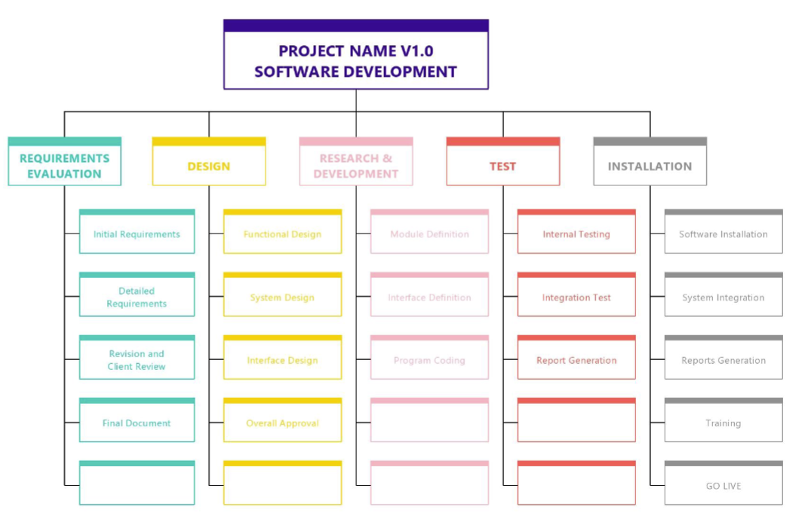
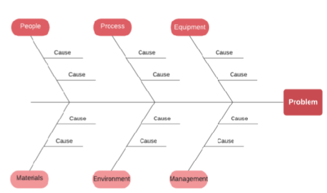
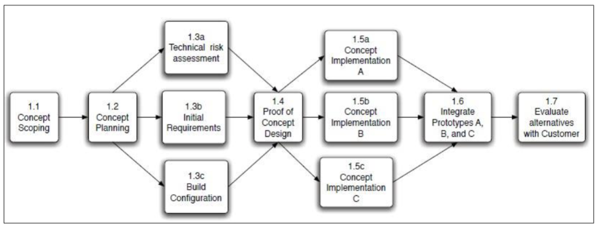
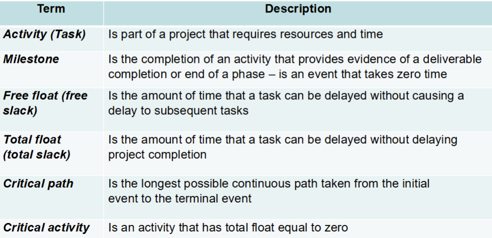

# Formal Project Scheduling

## Project Schedule
- One of the important artefacts generated during the project planning phase.
- Is used and maintained throughout the project to monitor and track project progress.
    - It is a living document
- Answers two important questions
    - How long will the system take to develop
    - How much will it cost
- Project Schedule contains
    - Duration and dependencies for each task
    - People and physical resources for each task
    - Milestone and deliverables
    - Project Timeline
    - Gantt charts -> bar chart shows schedule against against calendat
    
    - PERT(Program evaluation and review techinique charts) chart -> an activity network shows dependency and critical path
    

### Develop Project Schedule
1. Breakdown the task into small chunks you can deal with     - **Work Breakdown Structure (WBS)**.
2. Identify the **interdependencies** between the broken-down tasks and develop a **task network**.
3. Estimate the **effort** and the **time allocation** for each task.
4. **Allocate resources** for tasks and validate effort.
5. Develop the **project schedule**.

#### WBS
- Planning and executing large tasks is challenging:
    - Estimating the time and resources.
    - Identifying interim goals and deliverable.
    - Progress monitoring.
- Solution is to break the task down to manageable units:
    - Each task should have a specific outcome or a deliverable.
    - This creates a Work Breakdown Structure (WBS).

- Fishbone Diagram aka cause-effect diagram
- Used in software project management as a tool for identifying, sorting, and displaying possible causes of a specific problem or quality characteristic

- Problem Solving:
    - Helps teams identify the root cause of issues affecting project quality, deadlines, or budget.
- Visualization:
    - Visually organizes the causes of project issues into categories, making it easier to brainstorm and discuss these issues.
- Team Collaboration:
    - Engages various team members in the problem-solving process.
- Focus on Factors:
    - Common categories in software projects might include People, Processes, Tools, and External influences etc.

#### Identifying Task Dependencies
- constrained -> depends on another task

- unconstrained -> the task can start at any time

- Dependencies are caused by:
    - a task needing a work product of another task.
    - a task needing resources used by another task

#### Effort-time Estimation
- A common measure for estimating the effort for software is person-months.
    - The time in months for a single person working full time to complete the task.
- Three-point estimating is a widely-used technique used to estimate the duration (or cost) of a task with a more refined approach, than only using a single-point estimate.
    - It considers uncertainty and the risk of potential variation in task estimates.
    - But there are different types of three-point estimation
- The two most common methods of three-point estimating are the **Triangular Distribution** and the **PERT (Program Evaluation and Review Technique) Distribution**
    - **Triangular Distribution**

    Calculates the average of the three estimates. Less reliable.

    $$
    T_E = \frac{O + M + P}{3}
    $$

    - **O**     - optimistic time  
    - **P**     - pessimistic time  
    - **M**     - most likely time

    - **PERT Distribution**

    More commonly used due to its higher weighting of the most likely scenario (4M), weights the most likely estimate more heavily:

    $$
    T_E = \frac{O + 4M + P}{6}
    $$

    - **O**     - optimistic time  
    - **P**     - pessimistic time  
    - **M**     - most likely time

    - **How do we determine O, P and M?**

    This often comes through experience/expertise in having worked on previous similar projects.  
    Often it is an **well-informed best guess**.
#### Resource Allocation
- if the effort and time are known, get 
$$
Numberof Personnel = \frac{Effort}{\text{Time duration}}
$$

- Assigning people to tasks:
    - Although computing the number of personnel required for each task appears
simple, resource allocation is complicated task.
    - The project manager has to carefully consider the expertise of the people, and the availability of them for tasks, which might require validation and adjustment of the schedule

#### Develop the project Schedule
- PERT (Program Evaluation and Review Technique) chart:
    - A task network which shows the dependencies along with time related information and the critical path.
- PERT analysis helps:
    - Understand the characteristics of the project that will let project managers do scheduling trade-offs.
    - Perform critical path analysis.
    - Monitor project progress and re-plan

#### Critical Path Methods
- critical path 
    - Path with the longest duration.
    - Activities on the critical path have a total free slack of 0.
    - A delay in any of the activities in the critical path will cause the project to delay
- Crashing the project schedule
    - Shortening the total duration of the project by shortening the critical path. By removing the dependencies between activities in the critical path; or
    - Shortening the duration of activities in the critical path.
