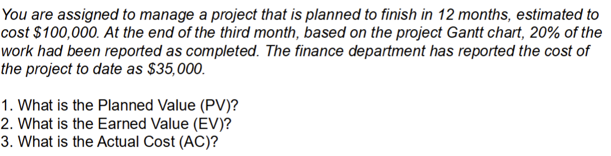

# Project Tracking and Control
- simple methods to track    
    - Periodic meetings where team members report progress.
    - Evaluating the results of reviews and audits conducted as part of the software engineering process.
    - Tracking formal project milestones.
    - Comparing actual start dates with scheduled start dates.
    - Meeting engineers and having informal discussions.
    - Using a formal method like earned value analysis.

### Earned Value Analysis EVA
- EVA can be used to:
    - report current/past project performance
    - predict future project performance based on current/past performance
- Results can be expressed in dollars and/or percentage

#### EVA calculation
- Planned Value (PV)
    - The authorized budget assigned to scheduled work. It represents the portion of the approved cost estimate planned to be
spent on a given activity during a specific time period.
- The Earned Value (EV)
    - The value of the work actually completed, expressed in terms of the approved budget for that work.
- Actual Cost (AC)
    - The total cost incurred for the work completed on a specific activity during a given time period.
- Schedule Variance Analysis
    - Uses EV and PV to calculate a variance to the project schedule.
- Schedule Variance
    - $SV = EV – PV$
    - **Expressed in currency units** (e.g., dollars). A positive value indicates ahead of schedule; negative means behind.
- Schedule Performance Index
    - $SPI = EV / PV$
    - A ratio (i.e., a fraction). An $SPI > 1$ indicates better than planned schedule performance; $SPI < 1$ means worse

#### EVA metrics example !!

