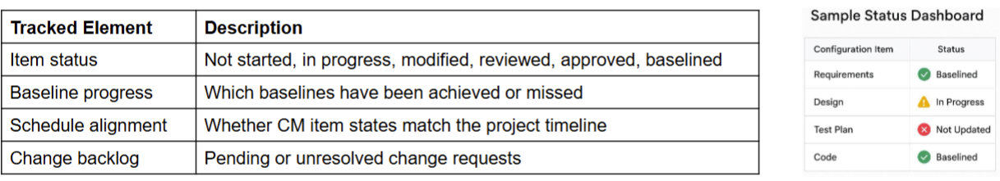

# Ethics in Professional Practice
- Ethics are the principles and values used by an individual to govern his or her actions and decisions.
- Organisational ethics express the values of an organization to its employees and/or other entities irrespective of governmental and/or regulatory laws

## Issues
- Different people may consider the same thing ethical or un-ethical
    - cultural factors 

### Micro ethics vs Macro ethics
- Ethics are not only big (Macro) issues
    - though big issues affecting many people, issues also happen in work place

- Micro ethics day-to-day

### Content of Ethical issues
- Privacy and Data Protection
- Algorithmic Bias
- Accessibility
- Intellectual Property
- Transparency and Explainability
- Security
- Impact on Employment
- Environmental Impact

## IEEE Code of Ethics Summary

1. **The Primacy of Public Interest**  
   - You will place the interests of the public above those of personal, business, or sectional interests.

2. **Honesty and Realism in Claims**  
   - You will be honest and realistic in stating claims or estimates based on available data.

3. **Avoiding Conflicts of Interest**  
   - You will reject bribery, avoid conflicts of interest, and disclose them if they arise.

4. **Improvement of Technical Competence**  
   - You will seek to improve your understanding of technology, its application, and potential consequences.

5. **Responsible Decision-Making**  
   - You will ensure decisions are made with full consideration of ethical implications, safety, health, and welfare.

6. **Respect for Intellectual Property**  
   - You will respect the privacy, confidentiality, and intellectual property of others.

7. **Fair Treatment of All Persons**  
   - You will avoid unlawful discrimination, harassment, and bullying in all forms.

8. **Support Colleagues and Report Misconduct**  
   - You will support colleagues and report any concerns of unethical behavior.

9. **Avoiding Harm**  
   - You will avoid injuring others, their property, reputation, or employment by false or malicious actions.

10. **Professional Integrity**  
   - You will uphold the dignity and reputation of the profession and IEEE.

## Australian Computer Society (ACS) Code of Ethics
1. The Primacy of Public Interest.
    - You will place the interests of the public above those of personal, business or sectional interests.
2. The Enhancement of Quality of Life.
    - You will strive to enhance the quality of life of those affected by your work.
3. Honest.
    - You will be honest in your representation of skills, knowledge, services & products.
4. Competence.
    - You will work competently and diligently for your stakeholders.
5. Professional Development.
    - You will enhance your own professional development, your colleagues & staff.
6. Professionalism.
    - You will enhance the integrity of the ACS & the respect of its members for each other.

#### Case Study: 
- Uber Greyball Scandal (2017)
    - Problem Uber faced:
        - In many cities (e.g., Portland, Boston, Paris), Uber operated without regulatory approval. Local governments tried to catch Uber drivers who were violating transport laws.
    - Uber’s response:
        - Instead of complying, Uber built secret software called Greyball to identify and block government officials who were investigating them.
    - How Greyball worked:
        - It collected data (like credit card info, device patterns, geolocation) to guess who might be a government inspector.
        - If the system detected an inspector, it showed them a fake version of the app — no cars appeared, or fake cars circled endlessly.
        - This made it very hard for authorities to prove illegal Uber activity.
    - Why it may have ethically mattered:
        - Deception against public authorities.
        - Risk to public safety (unregulated drivers).
        - Business goals prioritized over law and public trust
        

- Facebook & Cambridge Analytica (2018)
    - Problem Facebook faced:
        - Facebook’s platform allowed third-party apps to access users' personal data freely.
        - Facebook had weak oversight over how this data was used once collected by external developers.
        - They trusted that app developers would self-regulate — but did not monitor effectively.
    - Facebook’s response:
        - Facebook initially allowed apps to collect not just user data but friends' data — without friends' explicit consent.
        - When Facebook learned Cambridge Analytica had harvested tens of millions of profiles:
            - It asked them to delete the data. It did not independently verify that they complied. Facebook did not inform users affected by the breach until years later.
    - How it caused a problem:
        - A seemingly harmless app ("This Is Your Digital Life" personality quiz) collected massive amounts of data.
        - Cambridge Analytica bought this data from the app developer. They used it to build psychological profiles and micro-target political ads. Potentially influenced political outcomes without informed consent.
    - Why it may have ethically mattered:
        - Users never agreed to have their personal data (or their friends' data) harvested for political profiling.
        - Facebook withheld disclosure of the breach for a long time.
        - Facebook did not ensure data was used ethically after collection.
        - Created vulnerabilities where personal data could shape political behavior covertly
        

# Configuration Management
- The process of managing changes to a software system and maintaining the integrity and traceability
of the configuration throughout the system lifecycle.

## Why it matters
- Software System are fragile
    - Software projects produce hundreds of interrelated artifacts:
        - Code, requirements, diagrams, tests, documentation
    - A change to one can break many others
    - Without coordination, these systems become inconsistent, unstable, or even unusable

- What can go wrong
    - Conflicting versions cause test failures
    - Untracked changes lead to bugs in production
    - Teams overwrite each other’s work
    - Inconsistent documentation causes delivery delays

### Role of Configuration Management
- Tracking versions
- Managing dependencies
- Reverting changes safely
- Auditing what changed and why

#### Case Study
- Coles POS Outage (2020)
    - What Happened?
        - On Friday, March 20, 2020, Coles supermarkets across Australia experienced a nationwide payment system failure.
        - Customers were unable to pay for groceries for approximately 4 hours.
        - All stores were forced to close, affecting operations in every state and territory.
        - Coles later reported that the issue was due to a software update to their Point of Sale (POS)
    system.
    - Why does it matter?
        - Even a short outage caused by poor configuration management can lead to massive financial loss, reputational damage, and customer frustration.
    - Root Cause Analysis
        - A configuration change (update to software or related services) was deployed without:
            - Full regression testing across environments
            - Clear rollback documentation
            - Effective coordination with other dependent systems (e.g., payment gateways)
        - The update led to system-wide incompatibility, breaking the POS terminal functions
    - Recovery Enabled by Configuration Management
        - Fortunately, CM practices were in place:
            - The previous stable version was still stored and versioned
            - The update process was traceable, and dependencies were known
            - Staff could roll back to the earlier baseline version
        - After 4 hours, systems were restored and stores reopened

### Goal
- Goal is to manage change as 
    - change on an artefact may affect dependencies of others
    - may leave the configuration in an inconsistent state
    - Assume change in requirement -> change in The test plan, test cases and testing scripts for the code and code modules

### Software Configuration

- The total of all the artefacts
- Their current state
- The dependencies between them

## Core Activity

### Identification Types of Configuration item
- There are three different types
    1. Basic
    2. Aggregate
    3. Derived

- Example items
    - Requirements: Software Requirements Specification, individual requirements, use-cases
    - Design UML diagrams, class designs
    - Code: Source code, compiled binaries
    - Testing: Test plans, scripts, drivers
    - Documentation: User manuals, internal wikis

### Version Control
- Version control is the process of managing and tracking changes to configuration items
over time
- Supports
    - Track change history: Know what changed, when, and by whom
    - Rollback capability: Safely revert to a previous working version
    - Support collaboration: Prevent developers overwriting each other’s work
    - Enable reproducibility: Build or test any historical version
    - Release management: Tag and baseline known-good versions

### Verison vs. Variant vs. Release

#### Change Control: Managing Changes Across the System
- Change control is manual step in software lifecycle. It combines human procedures and automated tools.

- Include a Change Control Board (CCB) that approve test plans before they are executed
- Change request submitted and evaluated to assess technical merit, potential side effects, overall impact on other configuration object and system function, and project cost of change
- Process

### Change Management Plan: Coordinating Large-Scale Change
- Change Management Plan
    - A part of an overall configuration management plan to specifically control these changes to the configuration
    - Changes must be made in a way that allows everyone on the project team to find out:
        - exactly what changes need to be made
        - what they need to do to affect the change
        - why the change is being made
        - how it will impact them
- Baseline
   - A baseline is an artefact that is stable.
   - It has been formally reviewed and agreed upon, that is now ready for future development.
   - It can only be changed through a formal change management procedure.

### Configuration Auditing
- Ensuring Consistency and Integrity
    - Assuring that what is in the repository is actually consistent.
    - That all of the changes have been made properly

### Status Reporting
- Tracking the state of configuration
- Status reporting provides visibility into the state of configuration items and helps teams detect inconsistencies,
omissions, or delays

- Why it matters
   - Detect missing or outdated artifacts
   - Identify configuration drift early
   - Align development and CM progress
   - Enable informed decision-making